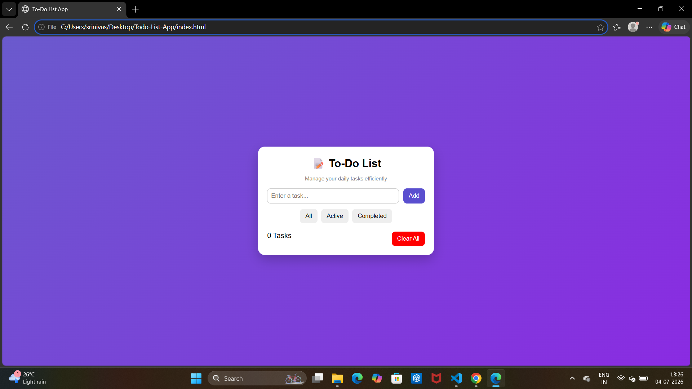

# Todo-List-App
# 📝 Todo List App

## 📌 Project Title

Todo List App

---

## 🎯 Objective

The objective of this project is to develop a simple, responsive, and interactive Todo List application using HTML, CSS, and JavaScript. This application helps users organize and manage their daily tasks by allowing them to add, complete, and delete tasks efficiently.

---

## ✨ Features

- Add new tasks
- Mark tasks as completed
- Delete tasks
- Store tasks using Local Storage
- Responsive and user-friendly interface
- Simple and attractive design

---

## 🛠️ Technologies Used

- HTML5
- CSS3
- JavaScript (ES6)

---

## 📂 Project Structure

```text
Todo-List-App/
│── index.html
│── style.css
│── script.js
│── README.md
│── Report.docx
│── output.png
```

---

## ▶️ How to Run the Project

1. Download or clone this repository.
2. Open the project folder.
3. Open the `index.html` file in any modern web browser.
4. Add, complete, and delete tasks using the application.

---

## 📸 Screenshots

### Application Output



---

## 🚀 Future Improvements

- Edit existing tasks
- Add task priorities
- Add due dates and reminders
- Search and filter tasks
- Dark mode support
- Drag-and-drop task management

---

## 👩‍💻 Author

**Srilatha Pappu**
